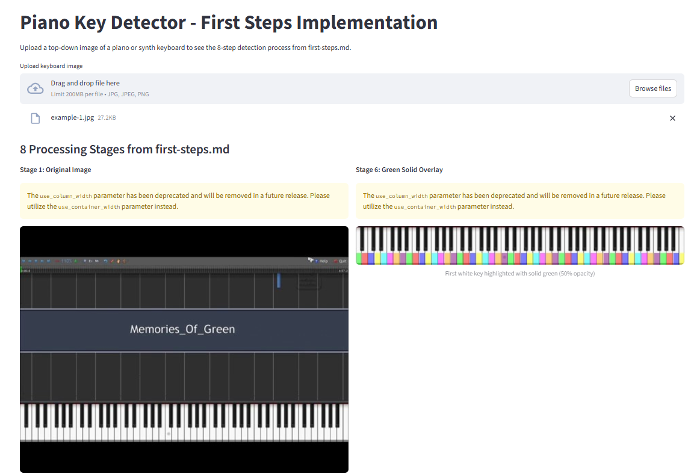

# Piano Keyboard Detector
Detects piano keyboards from images, with support for both traditional key detection and YOLOv8-based object detection.

This project includes:
- Traditional computer vision approach for key detection (main directory)
- YOLOv8 training pipeline for keyboard object detection (`labeller/` directory)
- Video downloading and frame extraction tools (`downloader/` directory)



## Quick Start

### Traditional Key Detection
1. Install requirements:
```bash
pip install -r requirements.txt
```

2. Run the Streamlit test interface:
```bash
streamlit run test_app.py
```

### YOLOv8 Object Detection Training
For training a YOLOv8 model to detect piano keyboards in images:

1. Navigate to the labeller directory:
```bash
cd labeller
```

2. See `labeller/TRAINING_README.md` for complete instructions on training your own YOLOv8 model.

## Project Structure

- `/` - Main keyboard key detection using traditional computer vision
- `/labeller/` - YOLOv8 training pipeline and dataset tools  
- `/downloader/` - Video downloading and frame extraction utilities
- `/prompt-history/` - Development history and prompts

This has been generated by Claude using CoPilot, and the prompts inside `prompt-history`. As instructions.md and agents.md are buggy in CoPilot currently (they get ignored), this is the prompt used before each request, via `/default`:

```
---
mode: agent
---
You should think about edge cases and ask questions before continuing, to ensure your work doesn't need many unnecessary iterations. Ask clarifying questions, as many as needed.

Provide an initial summary of the work you are about to do, the tasks you believe you need to carry out. Before continuing ask if this needs any adjustments and if your plan looks correct.

You should always delete any temporary files including test scripts you have generated after finishing your work.

Use the temp directory for all temporary images and test scripts, they should be put in this directory and run from this directory.

When you have finished, provide a one paragraph summary, no emojis or bullet points.
```